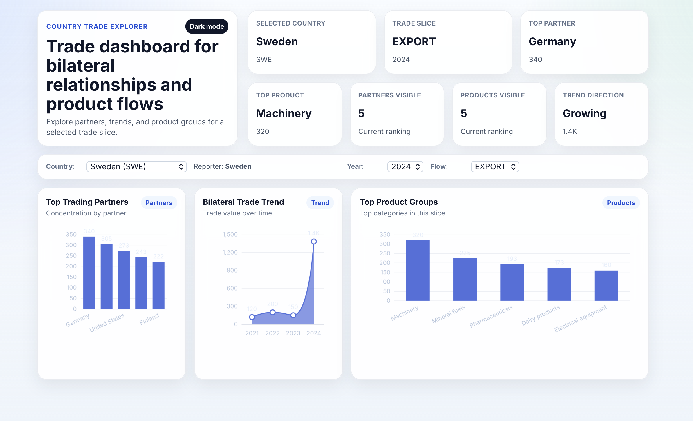
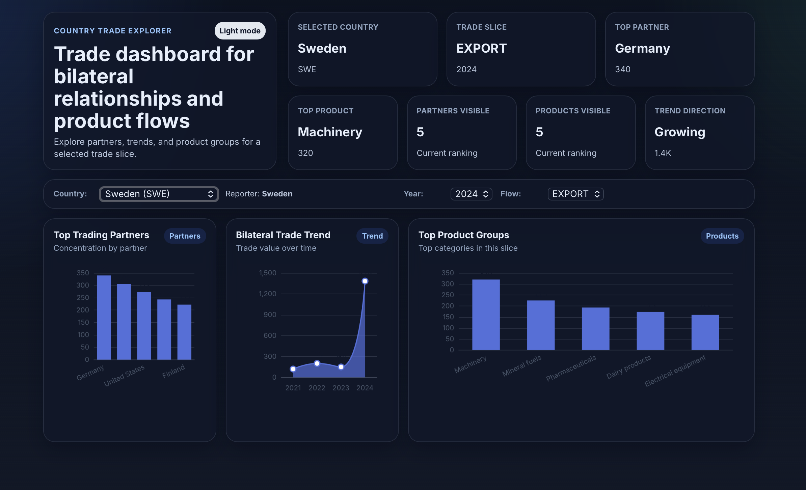

# Country Trade Explorer

A full-stack trade analytics project for exploring bilateral trade relationships between countries using a real UN Comtrade ingestion path.

## Overview

Country Trade Explorer allows a user to select a country and inspect:

- top trade partners
- bilateral yearly trade trends
- top traded product groups
- filterable import/export views
- metadata-driven year and flow selection

The project is designed as a portfolio-grade backend + frontend system:

- backend focuses on clean domain layering, ingestion separation, persistence, and query APIs
- frontend focuses on dashboard-style data presentation

## Dashboard Preview

### Light mode



### Dark mode



## Tech Stack

### Backend

- Java 21
- Spring Boot
- Spring Data JPA
- PostgreSQL
- Flyway
- Maven

### Frontend

- React
- Vite
- Apache ECharts

### Data Source

- UN Comtrade API

## Architecture

- `backend/` → Spring Boot API, ingestion, persistence, query services
- `frontend/` → React dashboard
- `docs/` → technical decisions and project notes
- `READ_AGENT.md` → working instructions for AI-assisted iteration

## Current Backend Capabilities

### Query layer

- `/api/health`
- `/api/countries`
- `/api/trade/partners`
- `/api/trade/bilateral`
- `/api/trade/products`
- `/api/trade/metadata`

### Ingestion layer

- separate application service for imports
- UN Comtrade adapter
- import endpoint for narrow controlled slices

### Database

- Flyway migrations
- seeded countries
- seeded UN M49 numeric codes for countries (used for UN Comtrade reporter/partner mapping)
- seeded trade observations
- imported rows persisted into `trade_observation`

## Current Frontend Capabilities

- dashboard hero section
- KPI cards
- partner chart
- bilateral trend chart
- product group chart
- loading states
- empty states
- backend-driven filters
- dark mode toggle
- theme persistence via localStorage

## Local Development

### Start PostgreSQL

```bash
docker compose up -d
```

### Backend

```bash
cd backend

CTE_DB_HOST=localhost \
CTE_DB_PORT=5434 \
CTE_DB_NAME=trade_explorer \
CTE_DB_USER=postgres \
CTE_DB_PASSWORD=postgres \
mvn spring-boot:run
```

### Frontend

```bash
cd frontend
npm install
npm run dev
```

## Backend Tests

Unit tests (no PostgreSQL required):

```bash
cd backend
mvn clean test
```

Integration smoke tests (requires PostgreSQL running via Docker):

```bash
docker compose up -d

cd backend

CTE_DB_HOST=localhost \
CTE_DB_PORT=5434 \
CTE_DB_NAME=trade_explorer \
CTE_DB_USER=postgres \
CTE_DB_PASSWORD=postgres \
mvn clean verify -Pit
```

## UN Comtrade Configuration

```bash
export UNCOMTRADE_ENABLED=true
export UNCOMTRADE_PREVIEW=true
export UNCOMTRADE_API_KEY="<primary key>"
export UNCOMTRADE_API_KEY_HEADER_NAME="Ocp-Apim-Subscription-Key"
export UNCOMTRADE_FINAL_DATA_URL="<working endpoint url>"

# Optional (defaults to partner breakdown)
# - all: partner-level rows (recommended)
# - 0: World totals only
export UNCOMTRADE_PARTNER_CODE=all
```

## Bootstrap Import on Startup

If enabled, the backend will automatically import one slice on startup (async) when UN Comtrade is enabled and the final-data URL is configured.

```bash
# Enable/disable startup import
export CTE_BOOTSTRAP_ENABLED=true

# Default demo slice
export CTE_BOOTSTRAP_REPORTER=USA
export CTE_BOOTSTRAP_YEAR=2024
export CTE_BOOTSTRAP_FLOW=IMPORT
```

## Import Example

```bash
curl -X POST http://localhost:8080/api/dev/imports/trade \
  -H "Content-Type: application/json" \
  -d '{
    "reporter": "USA",
    "year": 2024,
    "flow": "IMPORT"
  }'
```

To see what slices exist in the database:

```bash
curl -s http://localhost:8080/api/dev/imports/status | jq
```

## Project Status

Current state:

- fully working local stack
- database-backed core trade views
- real external source adapter connected
- portfolio-ready dashboard foundation

Next steps:

- stronger import replacement strategy
- broader country mapping
- production-ready real data ingestion
